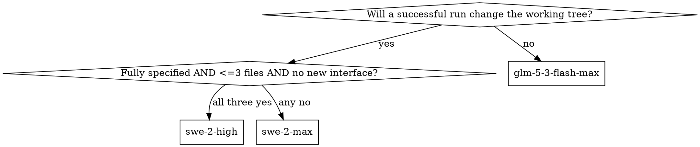

# Delegating to Devin

## Overview

`devin` is a terminal coding agent with a per-invocation model selector. Its config default (`agent.model` in `~/.config/devin/config.json`) is correct for exactly one class of task and wrong for the rest, so an invocation that omits `--model` silently gets the wrong engine.

**Core principle: every invocation names its model explicitly, and the model follows from the task class — never from convenience, cost, or the config default.**

## Command template

Fill every slot. `--model` is REQUIRED.

```bash
devin -p "<prompt>" \
  --model <from the routing table> \
  --permission-mode <auto for inlined research | dangerous for coding> \
  --respect-workspace-trust false
```

Those two permission modes are the only ones that work in `-p`. `accept-edits` looks like the right choice for coding and is not — see below.

## Finding the free model
To find models that are available for free use the command below. If you have the "devinp" installed you can use `devinp` to know the cost/performance trade-offs of each model. If any session return out of usage available you should use the free model if any available.

```bash
devin models list | grep Free
```

## Routing table

| Task class                                | Model       | 
| :---------------------------------------- | :---------- | 
| Research, planning | `glm-5-3-flash-max`  | 
| implementation review | `swe-2-max`  | 
| Investigation and debugging complex tasks | `glm-5-3-flash-max`  | 
| Complex coding                            | `swe-2-max`  | 
| Simple coding / configuration             | `swe-2-high` | 

## Classifying the task



### Research and planning → `glm-5-3-flash-max`

The deliverable is prose — an answer, a plan, or a judgment. A successful run leaves the working tree unchanged.

- **Research** — how does X work, where is Y implemented, what calls Z, mapping dependencies or data flow, comparing libraries or approaches, reading specs and docs, reproducing and diagnosing a bug _without_ fixing it.
- **Planning** — designs, task breakdowns, migration strategies, ADR drafts, estimating blast radius, deciding an approach before code exists.


### Implementation review → `swe-2-max`

Is the task to review an existing implementation (diff, branch, module) and judge it based on correctness, spec compliance, security, test coverage, quality?

### Complex coding → `swe-2-max`

Changes code, and **any one** of these holds:

- Touches 3+ files, or crosses a module, package, or process boundary.
- Introduces or changes an interface, schema, wire protocol, or public API.
- Has more than one defensible design, so the agent must choose.
- Needs new tests written alongside the implementation.
- Involves concurrency, state machines, data migrations, snapshot/lifecycle logic, or security-relevant code.
- Cannot be fully specified up front — the agent must explore the codebase to learn what to write.

### Simple coding / configuration → `swe-2-high`

Changes code or config, and **all** of these hold:

- Confined to 1–2 files.
- Fully specified before starting — you can state the exact end state in a sentence.
- Introduces no new interface, schema, or abstraction.
- Mechanical in nature: rename, version bump, add a field, adjust a config value, fix a typo, apply a known lint fix, or a single obvious one-line bugfix.

### Resolving edge cases

| Situation                                                                                          | Rule                                                                                                                                                                                       |
| :------------------------------------------------------------------------------------------------- | :----------------------------------------------------------------------------------------------------------------------------------------------------------------------------------------- |
| A coding task sits between simple and complex                                                      | Use the more powerful model. Under-powering costs a wasted run; over-powering costs nothing.                                                                                                               |
| Task mixes classes ("review this, then fix it")                                                    | Split into separate invocations, each with its own model. Do not pick one model for both halves.                                                                                           |
| "Fix this bug" with unknown cause                                                                  | Diagnosis is research; the fix is a separate run classed on its own.                                                                                                           |
| Task looks simple but the file is unfamiliar                                                       | Not fully specified → use the more powerful model.                                                                                                                                           |
| Writing or updating tests only                                                                     | Complex unless it is a mechanical assertion tweak in one file.                                                                                                                             |
| An empirical spike — deliverable is a report, but the run must install, execute, or measure things | Coding class. Classify by what the run must _do_, not by what it hands back. "Research" in the routing table means reading; a spike that runs things needs an engine that can.                 |

## Flags that matter

| Flag                              | Use                                                                                                                     |
| :-------------------------------- | :---------------------------------------------------------------------------------------------------------------------- |
| `-p, --print [PROMPT]`            | Non-interactive: run the prompt, print, exit. Required for scripted use.                                                |
| `--model <MODEL>`                 | Model selector. Env equivalent: `DEVIN_MODEL`.                                                                          |
| `--permission-mode`               | `auto` (default), `accept-edits`, `smart`, `dangerous`. See the warning below — the help text oversells `auto`.         |
| `--respect-workspace-trust false` | Print mode cannot show a trust prompt and **fails outright** in an untrusted directory. Pass this for any scripted run. |
| `--prompt-file <FILE>`            | Load the prompt from a file — use instead of shell-quoting a long prompt.                                               |
| `-c` / `-r [SESSION_ID]`          | Continue the most recent conversation / resume a specific one. `devin ls` lists sessions in the cwd.                    |
| `--export [PATH]`                 | Export the conversation after each turn.                                                                                |

## Permission modes in print mode — observed behavior

The `--help` text says `auto` "auto-approves read-only tools". In practice, an `-p` run under `auto` **aborts on the first tool call needing confirmation**, printing:

```
warning: rejected a tool call that requires confirmation. Running in non-interactive mode.
```

It then exits having produced nothing. Observed on plain repository _reads_, not just writes.

Four things this implies:

- **`accept-edits` does not rescue a coding run.** It auto-approves `Write`/`Edit` only. The shell tool (`exec`) still requires confirmation, so the run aborts the same way. Verified directly: `devin -p "Run the shell command: uname -s" --permission-mode accept-edits` exits with the warning above and no output. Since any real coding task builds, tests, or lints, **`accept-edits` cannot complete one.** Do not reach for it as the "safer than dangerous" option — it is not a weaker `dangerous`, it is a stronger `auto`.
- **A write that succeeds under `auto` proves nothing about the mode.** Check `permissions.allow` in `~/.config/devin/config.json` first — an entry like `Write(/private/tmp)` grants that path regardless of mode, and it is easy to mistake for `auto` being permissive.
- **`smart` may not exist on your account.** It warns `Smart permission mode is not available. Falling back to normal.` and then fails the same way. Never rely on it in a script.
- **`dangerous` auto-approves every tool, including destructive shell.** It is the only mode guaranteed to run unattended. Treat granting it as a decision, not a default.

### Shell cannot be scoped — do not offer a narrow allowlist you cannot deliver

`permissions.allow` is confirmed to work for **path scopes only** — `Read(<path>)` and `Write(<path>)`, the two the `--sandbox` help names as scope sources. Devin's shell tool is called `exec`, not `Bash`, and **no working command-scoped syntax is known.** `Bash(uname:*)` was tested and rejected; the run still aborted.

The trap is generalizing from the `Write(/private/tmp)` example: path grants exist, so scoped shell grants feel like they should too.

Practical consequence: when a coding delegation needs approval, the real choice is **`dangerous` or nothing**. Confirm that before presenting "add a narrow allowlist instead" as an option — offering a third path that turns out not to exist costs a full round trip with the person who has to decide.

**For research and planning runs, sidestep permissions entirely: inline the file contents into the prompt** so devin needs no tools at all. This is more reliable than any permission mode and makes the read-only guarantee structural rather than promised.

````bash
{ cat instructions.md
  echo; echo "## FILE: path/to/thing.ts"; echo '```'
  cat path/to/thing.ts; echo '```'
} > /tmp/prompt.md
devin -p --prompt-file /tmp/prompt.md --model glm-5-3-flash-max --permission-mode auto --respect-workspace-trust false
````

Cost: devin plans blind to anything you did not inline. It cannot see the working tree, so it will invent state — proposing to create directories that already exist, or flagging a decision as open when an ADR already settled it. **Reconcile its output against the real tree before acting on it.**

## Writing the prompt for a coding run

Beyond the task itself, four clauses change what comes back. Each addresses a failure mode that is hard to catch in review.

- **Ownership boundary.** Name the directory devin works in and say not to touch anything outside it. Where sibling work exists, name the paths it must _not_ create: "do not create `guest/kernel/` — another session owns it."
- **Corrections to the source material.** If the ticket, plan, or spec devin is told to follow contains something you already know is wrong, say so in the prompt and override it explicitly. Devin follows its stated source faithfully, including into a mistake.
- **Host capabilities.** State what the machine cannot do and what to do instead: "this host is macOS with no Linux toolchain and no KVM — author the scripts, verify what is verifiable, and record what is deferred." Without this, devin either burns the run failing or produces something that _looks_ built.
- **An honesty clause.** Say that a negative result is a valid deliverable and that unverified claims must be marked, not omitted: "a finding of 'this cannot run headless' is valuable — do not invent findings you did not observe." This is the highest-leverage sentence in the prompt. Fabricated detail is the failure mode most likely to pass review, and asking directly suppresses it — runs given this clause return explicit "unverified" sections and visible `TODO`/placeholder markers instead of plausible filler.

Also add **"commit nothing — leave your changes in the working tree"** whenever you intend to review before committing. The skill's warning about devin staging files unbidden (below) is a cleanup; this is the prevention.

## Running several delegations in parallel

Independent tasks run fine concurrently, one git worktree and branch each, with `-p` runs backgrounded. The scarce resource is not compute — it is **shared files**.

**Dispatch each run as its own backgrounded call — not one compound `for … & wait` command.** An agent harness may evaluate a compound command as a single unit and deny the whole thing, and the failure is confusing rather than obvious. Worse, anything else bundled into that command (the `mkdir -p` creating the output directory, say) silently never runs, so the next dispatches exit 1 having written nothing and the error surfaces as `No such file or directory` on the output path — which reads like a devin fault rather than a missing directory. Create and verify output directories in a separate step before dispatching anything.

**The rule: if N sessions would each edit the same shared file, forbid all of them from touching it and make those edits yourself.** Task boards, root index files, changelogs, `.gitignore`, and any per-directory map at the repo root are the usual suspects. A status line touched by three branches while a fourth renames the directory it lives in is an N-way conflict that no amount of careful merging fixes cheaply.

Corollaries worth stating in each prompt:

- Give every session an explicit list of paths it does **not** own.
- Centralize bookkeeping — ticket status, PR URLs, completion records — in the orchestrating agent, not the sub-sessions.
- Where a shared file genuinely needs a session's content, have it **report the needed line** in its final output and apply it yourself at merge time.

Then verify before opening PRs: `git merge-tree --write-tree <branch-a> <branch-b>` dry-runs each pair and reports conflicts without touching the working tree.

One cross-cutting check parallel runs need and single runs do not: **if one session introduces a lint, format, or type gate, test the other sessions' output against it.** A branch that was clean when authored can break CI the moment a sibling's gate merges.

## Common mistakes

- **Omitting `--model`.** The run silently inherits `agent.model` from config and quietly uses the wrong engine. The template exists so this cannot happen.
- **Classifying by prompt length.** A one-line prompt can describe a cross-cutting refactor. Classify by the change, not the sentence.
- **Using `glm-5-3-flash-max` for coding because it is the config default.** The default is set for research; it is not a fallback.
- **Forgetting `--respect-workspace-trust false`** in a scripted run, then reading the trust failure as a model or prompt problem.
- **Expecting machine-readable output.** There is no JSON output format — `-p` prints prose. Parse accordingly, or have devin write results to a file.
- **Expecting progressive output.** `-p` buffers everything until exit — a redirected log stays empty for the whole run, however long it is. Do not poll it for progress and do not read the silence as a hang. Watch side effects instead: `git status` in the worktree, or files the run is expected to create.
- **Reading exit 1 as a failed run.** A long deliverable can hit the model's maximum output length, in which case the run exits **1** and leaves a file truncated mid-sentence — which looks exactly like a crash and tempts a full re-run. **Inspect the partial output before re-dispatching**; it is often nearly complete and cheaper to finish by hand than to regenerate. Two structural defences for large prompts: split them into two runs, and ask for the risks/caveats section _first_ so truncation costs the least valuable part rather than the most.
- **Trusting a remedy named in a tool's own error message.** Error strings outlive the settings they recommend. pnpm 11's `ERR_PNPM_IGNORED_BUILDS` points at `pnpm approve-builds`, whose `onlyBuiltDependencies`/`ignoredBuiltDependencies` keys that major version had already replaced with `allowBuilds` — all three legacy forms were tried and still exited 1. Verify the remedy against the pinned major version, not against the message.
- **Assuming cwd survives.** devin resets the shell cwd after a run; do not chain commands that depend on it.
- **Assuming "commit nothing" is obeyed.** devin will sometimes run a full `git commit` despite an explicit instruction not to — observed on two of three coding runs in one batch, both attributing the commit to the local git identity with devin's own message and a `Co-Authored-By: Devin` trailer. This is stronger than the staging behavior below: it is a real commit, not just a dirty index. Check `git log` before starting verification, not just `git status`. An existing commit is not itself a problem — verify the diff exactly as you would an uncommitted one, then `git commit --amend` with your own message once verification passes; do not let a premature commit be your first evidence something went wrong procedurally.
- **Assuming the git index survives.** devin stages files (`git add`) as part of its own checkpointing — observed staging untracked files the run never touched. Check `git status` before and after, and unstage what you did not intend.
- **Trusting a plan that was written blind.** When you inline context instead of granting tool access, devin cannot see the working tree. Verify its factual claims about existing files and resolved decisions before acting.
- **Trusting the completion report of a run that _did_ have tools.** A run that lists commands and calls them green is making a claim, not supplying evidence. Re-run the cheap checks yourself — a report of "all verification passed" has been observed alongside a command that fails on re-run. Separately, **independently verify every external constant devin pins**: tarball hashes, package versions, upstream URLs, config symbol names. These get baked into build scripts where a wrong value survives review and fails much later.
- **Assuming a new dependency is pinned the way this repo pins everything else.** A run added a devDependency as `"^0.0.5"` — a caret range — when every other dependency in the same repo, across every prior ticket, is pinned exactly with no `^`/`~`. Check any new `package.json`/`go.mod` entry against the pinning style already used elsewhere in the same file before accepting it.

## Verifying available models

```bash
devin models list          # all families, IDs, context windows, prices
devin -p "Reply with exactly the name of the model you are running as, nothing else." --model swe-2-max
```

Model IDs change between CLI versions. If an ID in the routing table is rejected, re-check `devin models list` before substituting a different family.
